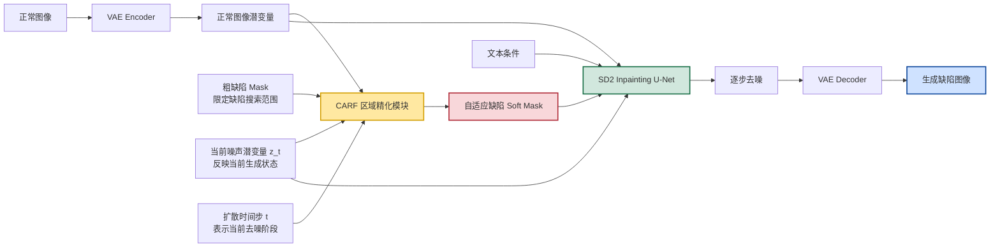
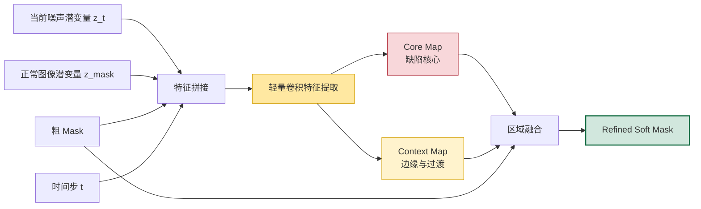
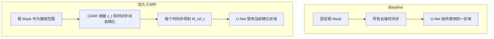
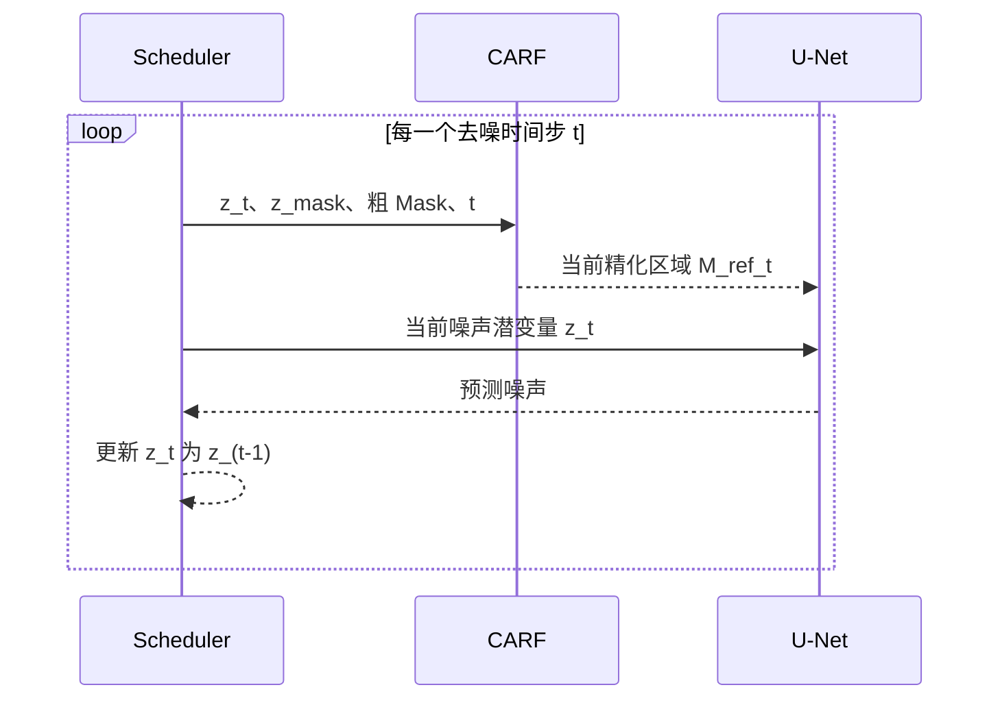

# CARF 网络结构图

> CARF：Coarse-Annotation Region Refinement，粗标注驱动的缺陷区域自精化模块。

## 整体流程



## CARF 精化的大致方案

CARF 在每个去噪时间步接收四种信息：

| 输入 | 作用 |
|---|---|
| 当前噪声潜变量 `z_t` | 表示当前时刻已经生成出的结构，让 CARF 判断缺陷响应实际出现在哪里 |
| 正常图像潜变量 `z_mask` | 提供正常背景、纹理和结构参照，帮助区分缺陷区域与正常区域 |
| 粗 Mask `M_coarse` | 只限定缺陷允许出现的大致搜索范围，不作为精确轮廓 |
| 扩散时间步 `t` | 告诉 CARF 当前处于粗结构生成阶段还是细节恢复阶段 |

这些输入在潜空间中拼接后，经过一个轻量卷积网络，分别预测：

- **Core Map**：缺陷主体所在的高置信区域；
- **Context Map**：缺陷边缘、光晕、阴影和渐变过渡区域。



Core Map 和 Context Map 融合后形成 `[0,1]` 范围的 Soft Mask。预测结果始终受到粗 Mask 约束，因此 CARF 可以在粗区域内缩小或软化实际生成范围，但不会让缺陷随意移动到标注区域之外。

## 与 Baseline 的区别



Baseline 把粗 Mask 直接作为 U-Net 的固定输入，因此整块区域都可能被重新生成。CARF 则把粗 Mask 转换成随图像状态和时间步变化的 Soft Mask，使 U-Net 更集中地修改真正需要生成缺陷的位置。

## CARF 在训练和推理中的位置

CARF **不是只在训练阶段使用**。它在训练和推理时都参与扩散去噪：

- **训练阶段**：每次采样时间步后，CARF 预测当前精化 Mask；该 Mask 进入 U-Net，同时使用弱监督损失训练 CARF，并与扩散去噪目标共同优化。
- **推理阶段**：加载训练得到的 `carf.pt`；在每一个反向去噪时间步，CARF 都重新根据当前 `z_t` 预测 `M_ref_t`，再把它送入 U-Net。



因此，训练阶段负责让 CARF 学会“如何精化”，推理去噪阶段负责实际使用这种精化能力。如果推理时关闭 CARF，U-Net 会重新使用固定粗 Mask，就不再是完整的 CARF 方法。

## 核心作用总结

```text
固定粗 Mask
     ↓
CARF 根据图像内容和扩散状态进行精化
     ↓
得到更符合实际缺陷范围的 Soft Mask
     ↓
减少无关背景修改，使缺陷尺度和边缘更加自然
```

图中可以用一句话概括：

> CARF 将粗 Mask 从固定的修复区域，转化为随扩散过程自适应变化的缺陷生成区域。
